# 基于深度学习的雾雨退化图像复原算法研究

## 摘  要
雾、雨天气会削弱图像对比度，遮挡纹理边缘，并引入颜色偏移和局部条纹。这类退化会降低图像观感，也会影响目标检测、道路感知和视频监控等后续视觉任务。围绕雾雨场景下的单幅图像复原问题，本课题构建了面向去雨和去雾任务的 MWIR-Net。网络采用多尺度 Transformer 编码器和解码器结构，在解码阶段引入天气感知 prompt，通过通道注意力调节不同尺度的退化表征，并结合 Charbonnier 重建损失和 Sobel 边缘一致性约束训练。实验使用 RAIN13K 与 RESIDE 相关数据训练，在 Rain100L、Rain100H、Test100、Test1200、Test2800、GT-RAIN-test、SOTS outdoor 和 NYU-Haze500 上验证。在 SOTS outdoor 上，MWIR-Net 的 TTA 推理结果达到 32.04 dB PSNR、0.9804 SSIM 和 0.009871 LPIPS；在 Rain100L 上，自训练模型达到 33.08 dB PSNR 和 0.9442 SSIM。实验结果表明，多尺度天气感知建模能改善去雾任务的重建质量，并在多类去雨测试集上保持较稳定的泛化表现。

关键词：图像复原；去雨；去雾；Transformer；天气感知 prompt

## Abstract
Fog and rain degrade images by reducing contrast, blurring edges, shifting colors, and introducing spatially non-uniform streaks. These degradations affect visual quality and may further influence downstream vision systems. This thesis studies single image restoration under foggy and rainy scenes and implements MWIR-Net, a multi-scale weather-aware image restoration network. The proposed model adopts a Transformer-based encoder-decoder backbone and injects weather-aware prompts into different decoder levels. Channel attention is used to modulate the prompt features, while Charbonnier reconstruction loss and Sobel edge consistency are combined during training. Experiments are conducted on RAIN13K and RESIDE related training data and evaluated on Rain100L, Rain100H, Test100, Test1200, Test2800, GT-RAIN-test, SOTS outdoor, and NYU-Haze500. On SOTS outdoor, the TTA version of MWIR-Net achieves 32.04 dB PSNR, 0.9804 SSIM, and 0.009871 LPIPS. On Rain100L, the self-trained model obtains 33.08 dB PSNR and 0.9442 SSIM. The results show that multi-scale weather-aware modeling improves dehazing quality and maintains stable generalization on several deraining benchmarks.

Key Words: image restoration; deraining; dehazing; Transformer; weather-aware prompt

## 目  录
（Word 文档中使用自动目录域，打开后更新目录即可。）

# 第1章 绪论

雾、雨等天气因素会改变光线在空气中的传播过程，也会在成像平面上形成局部遮挡。雾天图像常见的现象是整体对比度下降、远处物体边界变弱、颜色偏灰。雨天图像则常伴随细长雨纹、雨滴附着和局部反光。两类退化的表现不同，但都会削弱图像中的纹理和边缘信息。对于自动驾驶、道路巡检、安防监控和室外机器人系统，前端图像质量下降会向后续检测、识别和定位模块传递误差，因此雾雨场景下的图像复原具有明确的工程需求。
单幅图像去雾早期主要依赖物理模型和图像先验。暗通道先验利用无雾自然图像的局部统计规律估计透射率，在大气散射模型下得到清晰图像[1]。RESIDE 数据集给去雾算法提供了统一训练和测试基准，使不同方法的性能比较更具可复现性[2]。深度学习方法开始出现后，DehazeNet 将透射率估计过程改写为可训练网络[3]，AOD-Net 进一步把透射率和大气光相关项合并到端到端模型中[4]。这些工作推动了去雾方法从人工先验向数据驱动模型转变。
单幅图像去雨同样经历了从手工建模到端到端学习的变化。Fu 等人把雨纹去除转化为高频细节层的残差学习问题，证明卷积网络可以直接学习雨纹结构[5]。Yang 等人将雨纹检测与雨纹去除联合建模，使网络在强雨纹条件下具有更明确的结构约束[6]。DID-MDN 引入雨密度估计，把不同强度雨纹交给多流网络处理[7]。PReNet 采用渐进递归结构，提供了简单且性能稳定的去雨基线[8]。这些方法说明，退化强度和空间分布会明显影响复原难度。
评价图像复原算法不能只依靠主观观察。峰值信噪比反映像素级重建误差，结构相似性指标从亮度、对比度和结构三个角度评价图像质量[9]。LPIPS 利用深度特征距离衡量感知差异，能够补充 PSNR 和 SSIM 对局部纹理的刻画不足[10]。本课题的实验同时统计 PSNR、SSIM 和 LPIPS，并结合可视化对比分析图像边缘、颜色和雨纹残留情况。
近年来，图像复原网络开始从单一卷积结构转向更强的上下文建模结构。Transformer 的自注意力机制能建模较长距离的依赖关系[11]。MPRNet 采用多阶段渐进结构，在去雨、去模糊和去噪等任务上取得了较好的综合表现[12]。Restormer 面向高分辨率复原任务改造注意力和前馈网络，兼顾了性能和计算开销[13]。这些研究给雾雨复原提供了可借鉴的骨干设计。
实际场景中的退化类型并不总是已知。AirNet 用一个网络处理未知退化图像，通过退化编码引导复原过程[14]。TransWeather 使用 Transformer 结构处理雨、雾、雪等恶劣天气退化[15]。PromptIR 将提示学习引入多退化复原，通过轻量 prompt 表征退化类型和强度[16]。这些工作表明，多任务和多退化建模已经成为图像复原研究的重要方向。本课题在这一思路下设计 MWIR-Net，把天气感知 prompt 注入多尺度解码阶段，用同一网络处理去雨和去雾任务。

## 1.1 研究背景与意义

室外视觉系统的输入图像往往来自固定监控相机、车载相机或移动机器人相机。天气条件发生变化时，相机并不会同步改变成像模型。雾霾导致的散射会降低场景深度相关区域的对比度，雨纹和雨滴会遮挡局部纹理。若图像复原模块不能在前端修正这些退化，后续算法可能把雨纹误判为边缘，把雾化区域误判为低纹理背景，从而影响检测框、分割边界和运动估计。
雾雨复原的难点在于退化不是简单噪声。雾的强度与场景深度、大气光和散射系数有关；雨纹的方向、宽度、透明度和密度也会随风速、曝光时间和相机焦距变化。传统方法通常需要对退化过程作较强假设，当真实场景不满足这些假设时，容易出现颜色偏移、边缘过锐化或残留纹理。深度学习方法能从大量样本中学习更复杂的先验，但也面临跨数据集泛化和多退化适配问题。
从应用角度看，图像复原不是孤立的图像增强步骤。道路摄像头在雨夜容易产生亮条纹和车灯反光，雾天监控画面则常出现远处车辆边缘模糊。若复原结果把真实边缘抹平，检测算法会漏检小目标；若复原结果产生过强锐化，分割算法又可能把伪边缘当成物体边界。一个可用的复原模型需要同时考虑视觉质量和结构保真，而不是单纯追求图像看起来更亮或更锐。
雾雨退化还具有明显的场景相关性。城市道路、校园道路、树林和建筑立面中的纹理差异较大，同样的雨纹叠加在不同背景上会产生不同观感。室外雾图中的天空、道路和远处建筑在深度分布上也不同。模型若只在单一数据集上训练，往往会学习到数据集特有的颜色和纹理偏置。本文在多个去雨和去雾测试集上评估模型，就是为了观察这种跨场景差异。
本课题的意义主要体现在两个层面。工程层面，稳定的雾雨复原模型可以改善室外图像质量，为道路监控、无人系统和视觉测量提供更可靠的输入。方法层面，去雨和去雾既有差异也有共同点，二者都需要恢复局部细节并保持全局颜色一致。围绕这两类任务设计统一模型，有助于分析多尺度特征、退化表征和损失约束在图像复原中的作用。

## 1.2 国内外研究现状

去雾研究长期以大气散射模型为基础。给定有雾图像后，算法需要估计场景辐射、透射率和大气光。暗通道先验利用图像局部最小通道的统计规律，在多数室外图像上具有较好的可解释性[1]。这类方法的优势是模型清楚、参数较少，缺点是对天空区域、白色物体和非均匀雾比较敏感。深度学习方法出现后，透射率估计、清晰图像重建和端到端映射成为主要路线。RESIDE 的合成和真实图像基准缓解了训练样本不足的问题[2]，DehazeNet 和 AOD-Net 则分别代表了透射率学习与端到端去雾的典型思路[3][4]。
去雨研究面对的是更强的局部非均匀性。早期深度去雨方法多采用残差学习，把雨纹视为需要从输入中分离出来的高频成分[5]。当雨纹较密或背景纹理与雨纹方向接近时，单纯残差学习容易损伤细节。联合检测和去除的网络试图先定位雨纹区域，再完成复原[6]。密度感知网络把雨强划分为不同分支处理，提升了不同雨强条件下的适应性[7]。渐进式网络通过多阶段递归修正结果，使去雨过程更接近逐步清理雨纹的视觉过程[8]。这些方法说明，去雨算法不仅要恢复清晰背景，还要避免把真实纹理当作雨纹删除。
多任务图像复原研究关注同一模型对不同退化的适配能力。MPRNet 用多阶段结构平衡上下文和局部细节[12]。Restormer 将高效注意力用于高分辨率复原，缓解了全局注意力计算量过大的问题[13]。AirNet、TransWeather 和 PromptIR 分别从退化编码、天气嵌入和 prompt 引导等角度处理未知或多类型退化[14][15][16]。这些方法给本课题提供了直接参考。雾雨复原模型需要在不同尺度上识别退化，同时保持清晰图像的颜色和结构一致性。
现有方法在公开基准上已经取得较高指标，但仍存在三个值得关注的问题。其一，单任务模型在对应数据集上表现很强，迁移到另一类退化时需要重新训练或重新设计输出分支。其二，多任务模型虽然减少了模型数量，但不同退化之间可能发生相互干扰，训练不充分时会出现去雨过度平滑或去雾颜色偏移。其三，很多论文报告的结果来自不同训练集和不同评估脚本，若不统一复算，指标之间的可比性会减弱。本文的实验记录中特别保留训练协议和复算口径，正是为了降低这类影响。
国内关于雾雨图像复原的研究多集中在交通感知、视频监控和遥感图像增强等应用中。相关工作通常结合 Retinex、暗通道、注意力机制或生成式网络改善低能见度图像。与国外公开基准相比，国内应用场景更重视真实天气、部署成本和运行速度。受限于本课题数据和算力条件，本文主要在公开合成数据和部分真实雨图上验证模型，同时保留对真实场景泛化的分析。

## 1.3 研究内容

本课题围绕雾雨退化场景下的单幅图像复原展开，完成了数据准备、模型设计、训练实现、指标复算和可视化分析。数据层面，去雨训练使用 RAIN13K，去雾训练使用 RESIDE 相关 OTS 数据；测试集覆盖 Rain100L、Rain100H、Test100、Test1200、Test2800、GT-RAIN-test、SOTS outdoor 和 NYU-Haze500。为了保证评估口径一致，预测图像与目标图像按共同尺寸中心裁剪，并裁剪到 16 的整数倍后计算指标。
方法层面，本文设计 MWIR-Net。网络以多尺度 Transformer 编码器和解码器为主体，利用重叠卷积嵌入提取浅层特征，在编码端逐级降低空间分辨率并扩大通道数，在解码端逐级恢复分辨率。天气感知 prompt 模块根据深层特征生成不同尺度的退化提示，再与解码特征融合。prompt 通道注意力用于调节通道响应，使网络根据输入图像的退化特征选择不同的复原方向。
训练层面，本文实现了联合训练、二阶段微调、TTA 自集成推理和结构消融。基础训练阶段同时使用去雨和去雾样本，二阶段微调阶段分别针对去雨和去雾任务优化。损失函数由 Charbonnier 重建项和 Sobel 边缘一致性项组成。消融实验设置 zero_prompt 和 no_channel_attention 两种模式，用于分析 prompt 分支和通道注意力的独立作用。
实现层面，本文把数据准备、训练、测试和评估脚本分开管理。数据准备脚本负责把不同数据集整理成统一目录，训练脚本只读取列表文件和图像路径。测试脚本只负责生成复原图像，不在论文中直接引用临时日志结果。指标复算脚本对所有输出目录采用同一尺寸裁剪和同一 LPIPS backbone。这样的组织方式虽然增加了实验记录工作量，但能减少后续复查时的歧义。
实验层面，本文将 MWIR-Net 与 Restormer、PromptIR、MPRNet、AirNet 和传统 CLAHE 等方法进行比较。对比内容包括客观指标、真实输出图像、跨测试集泛化和消融结果。实验结论不只关注最高指标，也讨论模型在不同任务上的不足，尤其是自训练去雨模型与官方强基线之间仍存在的差距。

## 1.4 章节安排

第1章介绍课题背景、研究现状、研究内容和论文结构。第2章分析雾雨图像退化机理，说明数据集构建方式和评价指标。第3章给出 MWIR-Net 的网络结构、天气感知 prompt、损失函数和推理策略。第4章介绍算法实现、训练协议、评估口径和实验环境。第5章展示去雨、去雾和消融实验结果，并结合可视化图像分析模型表现。第6章总结全文工作，说明当前方法的局限，并给出后续改进方向。

# 第2章 雾雨退化机理与数据集构建

雾雨图像复原的前提是理解退化来源。雾退化主要来自空气中悬浮粒子对光线的散射，雨退化主要来自雨滴和雨纹对成像平面的遮挡。二者都可看作清晰图像到退化图像的映射，但映射形式不同。雾具有较强的全局性和深度相关性，雨则表现出局部稀疏或半稠密结构。本章从物理模型、数据组织和评价指标三个方面说明实验基础。

## 2.1 雾图像退化模型

大气散射模型通常把有雾图像表示为场景辐射衰减项与大气光叠加项。设 x 为像素位置，I(x) 为观测到的有雾图像，J(x) 为无雾图像，A 为全局大气光，t(x) 为透射率，则有

$$I(x)=J(x)t(x)+A(1-t(x))$$
（2.1）

$$t(x)=exp(-beta d(x))$$
（2.2）

式中 beta 表示散射系数，d(x) 表示场景深度。透射率越小，场景辐射经过空气传播后的保留比例越低，图像中远处区域越接近大气光颜色。该模型解释了雾天图像灰白、低对比度和远景细节弱化的原因。
在同一幅有雾图像中，近处目标和远处目标的退化强度并不一致。近处物体的 t(x) 通常较大，纹理和颜色保留较多；远处物体的 t(x) 较小，图像接近大气光。若算法对整幅图像采用同一个增强强度，近处区域可能被过度增强，远处区域仍然灰白。深度学习模型虽然不直接使用显式深度图，也需要通过多尺度上下文间接估计这类空间差异。
在真实场景中，A 和 t(x) 都未知。传统去雾方法需要从单幅图像中估计这些量，因此问题具有明显的不适定性。深度网络不一定显式输出透射率，但训练过程仍受到物理模型启发。若网络只关注局部纹理，容易忽略雾退化的全局颜色偏移；若网络只处理全局亮度，又可能损失远景边缘。MWIR-Net 采用多尺度结构，就是为了同时覆盖全局上下文和局部细节。

## 2.2 雨图像退化模型

雨图像退化常用加性模型描述。设 O 为雨图，B 为无雨背景，R 为雨纹层，则简化关系为

$$O=B+R$$
（2.3）

该模型适合描述透明度较低、雨纹较清晰的情况。真实雨天图像还可能包含雨滴附着、运动模糊、雾化水汽和地面积水反光，简单加性模型难以完全覆盖。雨纹与背景纹理在频域上有重叠，特别是树枝、栏杆和建筑边缘容易被误删。去雨网络需要判断哪些高频结构属于退化，哪些属于真实场景。
雨纹的方向性也会影响复原难度。轻雨图像中，雨纹通常稀疏且宽度较小，网络可通过局部残差恢复得到较好结果。强雨图像中，多层雨纹相互叠加，局部区域会出现半透明遮挡，背景纹理的可见度明显降低。若训练集中强雨样本不足，模型在 Rain100H 或真实雨图上容易保留残影。本文在测试集中同时使用轻雨、强雨和真实雨样本，就是为了观察这种差异。
从复原角度看，轻雨场景更重视纹理保留，强雨场景更重视遮挡区域恢复。单一尺度卷积对不同长度和方向的雨纹适应有限，多尺度特征能提供更宽的感受野。本文在编码器中逐级压缩空间尺寸，在解码器中结合浅层边缘信息和深层语义信息，以降低雨纹残留和纹理损伤。

## 2.3 数据集构建

本课题没有重新采集大规模天气图像，而是选用公开数据集并在本地组织训练和测试目录。去雨训练数据来自 RAIN13K，脚本生成 data/Train/Derain/rainy 与 data/Train/Derain/gt 的软链接，并写入 data_dir/rainy/rainTrain.txt。去雾训练数据来自 RESIDE 的 OTS 或 ITS 目录，实验主线使用 OTS，生成 data/Train/Dehaze/synthetic 与 data/Train/Dehaze/original 的软链接，并写入 data_dir/hazy/hazy_outside.txt。
测试数据覆盖合成和真实两类情况。去雨测试集包括 Rain100L、Rain100H、Test100、Test1200、Test2800 和 GT-RAIN-test。其中 Rain100L 雨纹较稀疏，适合观察模型对轻雨纹的处理；Rain100H 雨纹更密，能反映模型在强退化条件下的稳定性；GT-RAIN-test 包含真实雨场景，对合成训练模型的泛化要求更高。去雾测试集包括 SOTS outdoor 和 NYU-Haze500，前者来自 RESIDE 的室外合成测试，后者用于补充不同场景深度分布下的评估。
训练阶段采用随机裁剪 patch。去雨和去雾图像尺寸不完全一致，直接整图训练会带来较大的显存开销。随机裁剪能增加局部样本数量，也能让网络见到更多局部纹理组合。patch size 设置为 128，batch size 设置为 32。该设置在可用显存和训练稳定性之间取得了折中。对于去雾任务，过小 patch 可能削弱全局大气光估计，因此模型仍需要依赖深层多尺度特征获得较大感受野。
数据列表采用软链接方式构建。原始数据保持在 datasets 目录，训练目录只保存链接和列表文件。这样既便于切换 OTS、ITS 或其他来源，也避免重复占用磁盘空间。每次训练前，脚本会根据 max_derain 和 max_dehaze 参数限制样本数量，并通过 subset_seed 固定随机子集。本文的 5k 协议即表示去雨和去雾各取最多 5000 张训练样本。
图2.1 展示了 GT-RAIN 中的真实雨图示例。与合成雨图相比，真实雨图的雨纹强度、方向和局部亮度更不规则，背景中还可能存在水雾和反光。合成数据便于提供成对监督信号，真实数据能暴露模型泛化中的问题。本文实验主要使用成对指标评价，同时通过真实雨图和可视化对比判断复原后的视觉质量。

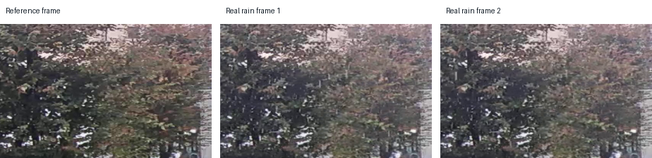
图2.1 GT-RAIN 真实雨图示例

## 2.4 评价指标

客观评价指标采用 PSNR、SSIM 和 LPIPS。PSNR 由均方误差计算得到，反映预测图像与目标图像的像素差异。设预测图像为 P，目标图像为 G，像素最大值为 MAX，则

$$MSE=1/N sum_i (P_i-G_i)^2$$
（2.4）

$$PSNR=10 log10(MAX^2/MSE)$$
（2.5）

PSNR 越高，像素级误差越小。该指标对颜色和亮度差异敏感，但不能充分反映结构感知质量。SSIM 从亮度、对比度和结构三个方面评价相似性[9]。当两幅图像边缘结构一致时，SSIM 通常较高。LPIPS 利用深度网络特征距离评价感知差异[10]，数值越低表示预测图像在感知空间中越接近目标图像。
三类指标各有侧重。PSNR 对平均误差敏感，图像轻微平滑后可能获得较高 PSNR，但视觉纹理不一定自然。SSIM 更关注结构一致性，对边缘和局部对比度变化较敏感。LPIPS 与人眼感知相关性更强，但不同 backbone 之间数值不完全一致。本文采用 alex backbone，并在所有模型上使用同一实现，保证 LPIPS 数值的横向可比。
本文统一使用保存后的输出图像复算指标。复算时预测图和目标图按共同尺寸中心裁剪，并裁剪到 16 的整数倍。这样可以避免不同测试脚本在张量计算、保存编码和尺寸处理上的差异。去雾文件按清晰图编号匹配目标图，去雨文件优先使用同名目标图，后缀不同的情况按文件 stem 匹配。

# 第3章 MWIR-Net 图像复原模型

MWIR-Net 面向去雨和去雾两类天气退化。网络主体采用多尺度编码器和解码器结构，并在解码阶段注入天气感知 prompt。设计思路并不把去雨和去雾完全拆成两个独立网络，而是让共享骨干学习通用的复原表示，再由 prompt 分支补充与退化类型相关的信息。图3.1 给出了 MWIR-Net 的整体结构。

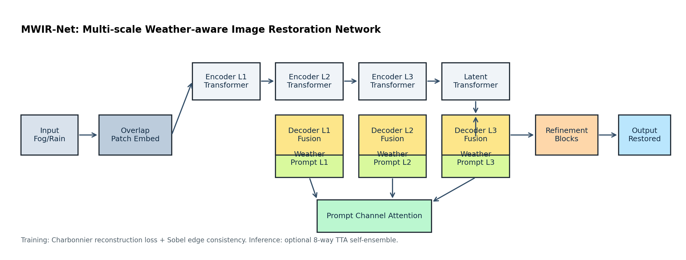
图3.1 MWIR-Net 网络结构

## 3.1 多尺度编码器和解码器

输入图像先经过 3×3 重叠卷积嵌入到特征空间。与直接切块不同，重叠卷积保留了相邻像素之间的连续性，适合低层视觉任务。编码器包含四个尺度。第一级保持原始空间分辨率，后续尺度通过 PixelUnshuffle 下采样，在空间尺寸减半的同时增加通道数。深层特征具有更大的感受野，能够捕捉雾带来的全局亮度变化和大面积低对比区域。
解码器按相反方向逐级上采样，并与对应编码层特征进行拼接。跳跃连接保留浅层边缘和纹理信息，对去雨任务尤为重要。网络输出端采用 3×3 卷积预测残差，并与输入图像相加得到复原图像。残差学习使网络重点关注退化成分和局部修正，不必从零生成整幅图像。
在具体通道设置上，网络的基础维度为 48，编码器各层通道数随尺度逐步增加。默认 block 数为 [4, 6, 6, 8]，解码端与编码端保持对称，并在输出前加入 4 个 refinement block。这样的配置比浅层卷积网络具有更强表达能力，也比单尺度 Transformer 更适合高分辨率复原。下采样和上采样分别由 PixelUnshuffle 和 PixelShuffle 完成，减少了插值操作带来的模糊。
跳跃连接并不是简单地把浅层特征复制到输出端。解码器在每一级拼接编码特征后，会通过 1×1 卷积调整通道数，再送入 Transformer block 继续融合。这样既保留了浅层边缘，又允许深层上下文对浅层纹理进行筛选。对于雨纹和真实边缘交错的区域，浅层特征提供位置细节，深层特征帮助判断该细节是否应被保留。
各尺度内部使用 Transformer block 处理特征。与纯卷积相比，自注意力能在更大范围内聚合信息。对于雾图像，远景区域和天空区域需要依赖全局上下文估计颜色恢复方向；对于雨图像，较长雨纹可能跨越多个局部窗口，需要非局部关系辅助识别。多尺度结构和注意力机制共同构成 MWIR-Net 的主干。

## 3.2 Transformer 复原块

每个 Transformer 复原块由层归一化、多头转置自注意力和门控深度卷积前馈网络组成。层归一化用于稳定特征分布，注意力分支负责建立通道和空间位置之间的依赖关系，前馈分支通过 1×1 卷积、深度卷积和 GELU 激活补充局部非线性表达。
设输入特征为 X，注意力分支记为 Attn，前馈分支记为 FFN，则一个复原块可写为

$$Y=X+Attn(LN(X))$$
（3.1）

$$Z=Y+FFN(LN(Y))$$
（3.2）

这种残差结构有利于梯度传播，也降低了深层网络训练难度。注意力分支先通过 1×1 卷积生成 Q、K、V，再经过深度卷积引入局部邻域信息。Q 和 K 归一化后计算相似度，温度参数按头学习。该设计借鉴了高分辨率复原网络中的高效注意力思想[13]，避免直接在大尺寸空间上计算高开销注意力。
注意力分支中的深度卷积具有实际作用。单纯的通道注意力或全局相似度计算容易忽略局部连续结构，而图像复原恰恰依赖邻域内的纹理和边缘。把深度卷积放在 QKV 生成之后，等于在计算相似度前已经融入局部上下文。对去雨而言，这有助于识别细长雨纹的局部方向；对去雾而言，这有助于恢复边缘过渡区域。
前馈分支采用门控形式。输入特征经过通道扩展后分为两部分，一部分通过 GELU 激活，另一部分作为门控信号，两者逐元素相乘后再投影回原通道数。门控操作能抑制与复原无关的响应，在雨纹和背景纹理混杂区域具有一定优势。
层归一化采用带偏置版本。低层视觉任务中，特征分布与图像亮度、颜色和局部纹理直接相关，完全去除均值偏置可能影响颜色恢复。带偏置归一化在稳定训练的同时保留一定平移能力。实验代码中保留 BiasFree 和 WithBias 两种选项，主实验使用 WithBias。

## 3.3 天气感知 prompt 模块

多退化复原的关键是让网络知道当前输入更接近哪类退化。MWIR-Net 在解码端设置三组天气感知 prompt，分别对应不同空间尺度。prompt 模块内部维护一个可学习参数张量，包含多个 prompt 原型。给定输入特征后，模块先对空间维度做平均池化，得到全局退化描述，再通过线性层产生 prompt 权重。

$$w=softmax(W GAP(X))$$
（3.3）

$$P=sum_k w_k P_k$$
（3.4）

式中 GAP 表示全局平均池化，P_k 为第 k 个可学习 prompt 原型。加权后的 prompt 会被插值到当前特征分辨率，并经过 3×3 卷积细化。随后，通道注意力根据 prompt 自身的统计响应生成通道权重，得到调制后的天气提示特征。
prompt 特征不直接输出图像，而是与解码特征拼接后送入 Transformer block。这样做的好处是，天气提示只改变解码过程中的特征选择，而不破坏编码器对通用图像结构的表达。对于去雾图像，prompt 可以引导网络更关注颜色和全局对比度恢复；对于去雨图像，prompt 更偏向局部条纹抑制和边缘保留。
MWIR-Net 在三个解码尺度使用 prompt。最深层 prompt 的通道数较大，主要处理全局退化描述；中间层 prompt 参与结构恢复；浅层 prompt 更接近输出图像，对局部纹理和边缘有直接影响。多尺度注入比单点注入更灵活，因为雾和雨的复原需求并不集中在同一层。去雾需要深层全局颜色校正，去雨需要浅层局部纹理判断。
通道注意力由全局平均池化和两个 1×1 卷积组成。它对 prompt 特征生成 0 到 1 之间的通道权重，从而抑制不适合当前输入的提示通道。对于输入为轻雨图像时，强雾相关通道的响应应降低；对于输入为浓雾图像时，雨纹相关通道的响应不应占主导。该机制的设计目标是提高 prompt 的选择性。
为了分析 prompt 分支的作用，代码中保留了两种消融模式。zero_prompt 将 prompt 输出置零，用于观察没有天气提示时的结果。no_channel_attention 保留 prompt 原型和权重生成，但关闭通道注意力，用于分析通道调制是否带来独立收益。消融结果在第5章给出。

## 3.4 损失函数

训练目标由像素重建项和边缘一致性项组成。像素项默认使用 Charbonnier 损失[18]，该损失可视作 L1 损失的平滑形式，对异常误差比 L2 损失更稳健。设预测图像为 R，目标图像为 G，epsilon 为平滑常数，则

$$L_char=mean sqrt((R-G)^2+epsilon^2)$$
（3.5）

边缘一致性项使用 Sobel 算子分别计算预测图和目标图的水平、垂直梯度，再计算 L1 距离。设 Sx 和 Sy 分别表示两个方向的 Sobel 卷积，则

$$L_edge=||Sx(R)-Sx(G)||_1+||Sy(R)-Sy(G)||_1$$
（3.6）

$$L=L_char+lambda L_edge$$
（3.7）

边缘损失的作用是约束复原图像不要过度平滑。去雨时，网络需要去除雨纹但保留真实边缘；去雾时，网络需要恢复远景轮廓但避免产生过强锐化。实验中联合训练阶段使用 0.05 的边缘权重，二阶段微调阶段使用 0.02 的边缘权重。较小权重能减轻边缘项对颜色恢复的干扰。
Sobel 边缘一致性只在灰度图上计算。这样可以降低颜色通道差异对边缘项的影响，使损失更关注结构变化。边缘项并不会判断某条高频结构是真实边缘还是雨纹，因此它不能单独使用。若边缘权重过大，网络可能保留雨纹或产生锐化伪影。本文把它作为重建损失的补充约束，而不是主损失。
联合训练阶段仍保留 L1 损失作为基础版本，是为了观察模型从零训练时的稳定性。二阶段微调改用 Charbonnier 损失后，输出图像在局部异常误差上的波动更小。实验表格显示，二阶段 Charbonnier 加边缘约束版本在去雨和去雾任务上均优于从零训练版本。

## 3.5 TTA 自集成推理

测试时可启用 8 路 TTA 自集成。输入图像经过四种旋转角度和对应水平翻转得到增强样本，网络分别预测后再反变换回原坐标系，并对八个结果取平均。该策略不改变模型参数，能降低单次推理中的方向偏差。对于雨纹方向较明显的图像，旋转和翻转增强可以缓解网络对固定方向雨纹的依赖；对于去雾任务，TTA 主要起到平滑预测噪声的作用。
TTA 会增加推理时间，因此本文把常规推理和 TTA 推理分开报告。论文中的主结果优先采用完整测试集上的常规推理；当 TTA 输出完整且指标更优时，将其作为补充结果说明。Rain100H 的 TTA 当前只完成 56 张图像，完整集比较仍以 100 张常规推理结果为准。

# 第4章 算法实现与实验设置

本课题基于 PyTorch 和 Lightning 完成模型训练、测试和指标复算[19]。工程目录包含模型定义、训练入口、测试入口、数据准备脚本、评估脚本和可视化脚本。为了使论文实验与代码输出保持一致，本章记录训练协议、数据口径和评估流程。

## 4.1 工程实现

模型结构位于 net/mwirnet.py。文件中定义了 LayerNorm、Attention、FeedForward、TransformerBlock、WeatherPromptBlock 和 MWIRNet 等模块。训练入口 train.py 使用 LightningModule 封装网络、损失函数和优化器。测试入口 test.py 支持去雨、去雾和 TTA 推理，并按测试集名称生成输出目录。
数据准备脚本 tools/prepare_mwir_data.py 根据本地 datasets 目录生成软链接。这样做能避免复制大规模图像，也能让训练脚本使用统一目录。评估脚本 tools/evaluate_baseline_outputs.py 遍历输出图像和目标图像，统一计算 PSNR、SSIM 和 LPIPS。可视化脚本把输入图、基线结果、MWIR-Net 结果和真值图拼接成网格或长条图，便于论文和答辩展示。
训练代码中，MWIRLitModel 的 training_step 从数据集中读取退化图像和清晰图像，网络输出复原结果后计算像素损失和边缘损失。edge_loss_weight 为 0 时，边缘项自动置为零；pixel_loss_type 可在 L1 和 Charbonnier 之间切换。这样的参数化实现便于在不改动主体代码的情况下进行阶段训练和损失对比。
初始化函数 load_compatible_init 会读取 checkpoint 中形状匹配的张量，并跳过不兼容参数。由于 MWIR-Net 在公开复原骨干上加入 prompt 分支，部分参数形状与已有权重不同，严格加载会失败。兼容加载策略保留了主干可复用权重，同时允许新增模块随机初始化。这也是本文能够比较随机初始化和兼容初始化的基础。
图4.1 给出了训练和评估流程。原始数据经过目录整理后送入训练脚本，训练完成的 checkpoint 用于不同测试集推理。保存后的输出图像不直接沿用测试日志指标，而是进入统一复算脚本，得到可比较的表格。该流程减少了不同模型输出口径不一致的问题。

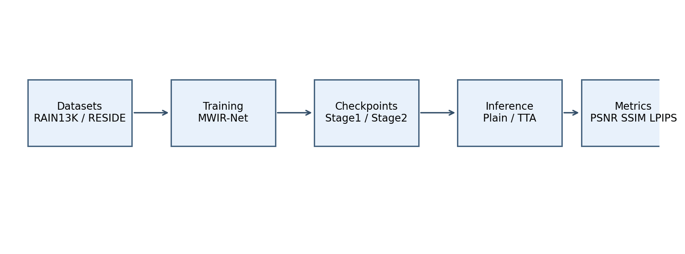
图4.1 MWIR-Net 训练与评估流程

## 4.2 训练协议

训练采用 AdamW 优化器[17]，学习率调度为线性 warmup 加余弦退火。基础联合训练使用去雨和去雾样本各最多 5000 张，训练 12 个 epoch，batch size 为 32，patch size 为 128，初始学习率为 2e-4。为比较初始化的影响，实验分别保留随机初始化版本和兼容公开复原权重初始化版本。
二阶段微调针对单任务进行。去雨二阶段从联合训练最后一轮权重初始化，使用 RAIN13K 中最多 5000 张样本训练 8 个 epoch，学习率降到 1e-5。去雾二阶段使用 OTS 去雾样本训练 4 个 epoch。二阶段损失统一采用 Charbonnier 加 0.02 Sobel 边缘一致性。表4.1 汇总了主要训练协议。
warmup 阶段用于缓解训练初期梯度不稳定。图像复原网络输出与输入高度相关，若学习率一开始过大，残差分支容易产生明显颜色偏移。余弦退火在训练后期逐步减小学习率，有利于模型在像素级任务上收敛到更平滑的解。二阶段微调学习率设置为 1e-5，是因为初始化权重已经具备基本复原能力，过大的学习率反而可能破坏已有表示。
公平消融实验只改变 ablation_mode，其余训练参数保持一致。每种模式使用 seed 0、1、2 重复训练，报告均值和标准差。这样可以避免单次实验偶然波动导致错误判断。由于训练成本限制，本课题暂未完成 full 模式的三次重复，因此第5章只把 zero_prompt 和 no_channel_attention 的差异作为当前阶段结论。

表4.1 MWIR-Net 主要训练协议
| 阶段 | 任务 | 初始化 | 主要设置 | 损失函数 |
| --- | --- | --- | --- | --- |
| 5k_12epoch | 去雨和去雾 | 随机初始化 | 12 epoch，batch size 32，patch 128，lr 2e-4 | L1 + 0.05 Sobel |
| 5k_12epoch_init | 去雨和去雾 | 兼容公开复原权重 | 12 epoch，batch size 32，patch 128，lr 2e-4 | L1 + 0.05 Sobel |
| stage2_charb_edge002 | 去雨 | 5k_12epoch_init | 8 epoch，lr 1e-5，RAIN13K 5000 张 | Charbonnier + 0.02 Sobel |
| dehaze_stage2 | 去雾 | 兼容阶段权重 | 4 epoch，lr 1e-5，OTS 去雾单任务 | Charbonnier + 0.02 Sobel |
| fair_ablation | 去雨 | 5k_12epoch_init | 8 epoch，seed 0、1、2 | Charbonnier + 0.02 Sobel |

## 4.3 对比方法

对比方法包括传统增强方法和近年深度复原方法。传统去雾使用 CLAHE 作为无训练基线。深度方法包括 MPRNet、Restormer、AirNet 和 PromptIR。MPRNet 和 Restormer 是图像复原强基线，AirNet 与 PromptIR 面向多退化或全任务复原。由于不同官方模型的训练数据和训练策略不完全相同，本文在表格中标注 official、init、stage2 等来源，避免把不同训练口径混为一谈。
MWIR-Net 的主要版本包括 5k_12epoch、5k_12epoch_init、stage2_charb_edge002、final_plain_multisplit 和 final_tta_multisplit。去雾结果中，stage2_charb_edge002_tta_dehaze 是当前最优版本。去雨结果中，TTA 版本在 Rain100L 上优于常规推理，但与官方强基线仍有差距。
official 表示使用对应方法公开权重直接推理，通常代表该方法在较大数据和成熟训练协议下的表现。init 表示使用公开复原权重作为初始化后，在本文 5k 协议下继续训练。stage2 表示在联合训练或初始化权重基础上做单任务微调。这样的命名能帮助读者区分模型结构能力、训练数据规模和微调策略三类因素。
传统 CLAHE 只在去雾任务中作为参考。它通过局部直方图均衡增强对比度，不需要训练数据，运行成本较低。该方法能改善部分低对比图像的观感，但不符合大气散射模型，也不会恢复真实颜色。因此 CLAHE 的作用主要是提供传统增强下限，而不是作为深度去雾方法的直接竞争对象。

## 4.4 指标复算口径

所有 PSNR、SSIM 和 LPIPS 均基于保存后的输出图像统一复算。预测图像和目标图像可能存在尺寸或后缀差异。复算脚本先读取 RGB 图像，再按共同尺寸中心裁剪，并把高和宽裁剪到 16 的整数倍。去雾图像根据文件名第一个下划线前的 clean id 匹配目标图，去雨图像优先同名匹配，后缀不同的情况按 stem 匹配。
LPIPS 使用 alex backbone。PSNR 和 SSIM 越高表示复原图像越接近真值，LPIPS 越低表示感知距离越小。由于测试日志中的 PSNR 和 SSIM 是直接在模型输出张量上计算，保存后图像复算可能存在轻微差异。论文中的完整表格统一采用保存图像复算口径。
中心裁剪到 16 的整数倍与模型结构有关。网络多次使用下采样和上采样，输入尺寸若不能被 16 整除，部分实现需要 padding 或裁剪。不同方法的 padding 策略可能不同。统一按 16 的整数倍裁剪后，比较区域一致，能减少边界 padding 对指标的影响。该处理不会改变图像主体内容，只舍弃少量边缘像素。
保存图像复算还有一个好处。答辩或复查时，评委看到的是保存后的图像文件，而不是训练过程中的临时张量。若论文表格引用张量指标，图像文件重新计算后可能出现差异。本文把保存图像作为唯一指标来源，使论文、输出目录和可视化材料保持一致。

## 4.5 实验环境

实验在 Linux 环境下完成，主要依赖 PyTorch、Lightning、NumPy、Pillow、scikit-image 和 LPIPS。训练使用单张 GPU，混合精度设置为 16-mixed。训练日志保存到 logs 目录，checkpoint 保存到 checkpoints 或外部运行目录，推理输出保存到 outputs。大规模数据和模型权重不纳入版本管理，只保留代码、指标汇总和论文图表。
为了保证实验可追踪，本文在 docs/所有模型指标汇总.md 中记录输出目录、训练协议、图像数量和复算指标。公平消融实验使用 seed 0、1、2 三次重复，并报告均值和标准差。若某个输出只覆盖部分图像，例如 Rain100H 的 TTA 结果只有 56 张，则在表格备注中说明，不把它作为完整集主结论。

# 第5章 实验结果与分析

本章从客观指标和视觉效果两方面分析 MWIR-Net。去雨部分重点观察 Rain100L、Rain100H 和其他测试集上的泛化表现。去雾部分重点分析 SOTS outdoor 和 NYU-Haze500。消融实验用于判断天气感知 prompt 和通道注意力的独立贡献。

## 5.1 Rain100L 去雨结果

Rain100L 是轻雨纹去除的常用测试集，图像数量为 100。表5.1 给出了主要方法的复算结果。官方 Restormer 的 PSNR 为 37.57 dB，PromptIR 的 SSIM 和 LPIPS 分别为 0.9778 和 0.016323，在该数据集上仍是强基线。MWIR-Net 的 TTA 版本达到 33.08 dB PSNR、0.9442 SSIM 和 0.087578 LPIPS，较从零训练的 5k_12epoch 版本有明显提升。该结果说明，兼容初始化、二阶段微调和 TTA 对去雨性能有直接帮助。

图5.2 至图5.5 展示了 Rain100L 的复原效果。MWIR-Net 能去除大部分明显雨纹，背景轮廓保持较完整。与 PromptIR 官方模型相比，MWIR-Net 在细节锐度和局部纹理上仍存在差距，部分区域会留下浅色残影。造成差距的原因可能包括训练数据规模较小、训练轮数有限，以及当前 prompt 模块在去雨任务中的独立增益不稳定。
从自训练模型内部比较看，MWIR-Net-final_tta_multisplit 比 final_plain_multisplit 的 PSNR 高 0.41 dB，SSIM 高 0.0048，LPIPS 低 0.003892。TTA 的收益说明模型对方向变换仍有一定敏感性。后续若在训练阶段加入更充分的数据增强，可能减少推理阶段对 TTA 的依赖。
Rain100L 中部分图像背景较干净，雨纹与背景之间区分明显，强基线模型可以几乎完全去除雨纹。MWIR-Net 的输出在这类样本上也能恢复主体结构，但局部细节的对比度略低。对于树枝、窗框和道路纹理较密的样本，模型会在保留背景边缘和删除雨纹之间出现折中。该现象说明，边缘一致性损失虽然能减少过度平滑，但不能完全解决雨纹与背景高频重叠的问题。
官方 Restormer 和 PromptIR 的指标高于 MWIR-Net，不能简单归因于网络结构差异。官方权重通常经过更充分的数据训练和参数调节，而本文的 MWIR-Net 主要围绕毕业设计实验条件实现。若后续扩大训练集、增加训练轮数，并补充 full 模式公平消融，MWIR-Net 的去雨性能仍有提升空间。

表5.1 Rain100L 去雨结果
| 方法 | 图像数 | PSNR | SSIM | LPIPS |
| --- | --- | --- | --- | --- |
| Restormer-official | 100 | 37.57 | 0.9741 | 0.042389 |
| PromptIR-official | 100 | 37.32 | 0.9778 | 0.016323 |
| MPRNet-official | 100 | 34.95 | 0.9589 | 0.073253 |
| AirNet-official-All | 100 | 34.90 | 0.9667 | 0.027842 |
| MWIR-Net-final_tta_multisplit | 100 | 33.08 | 0.9442 | 0.087578 |
| MWIR-Net-final_plain_multisplit | 100 | 32.67 | 0.9394 | 0.091470 |
| MWIR-Net-5k_12epoch | 100 | 25.07 | 0.8110 | 0.259754 |

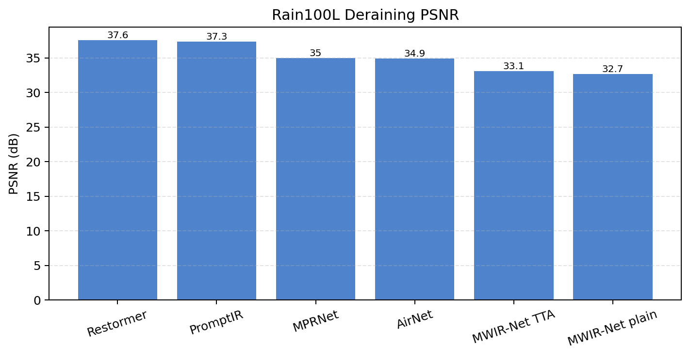
图5.1 Rain100L PSNR 对比

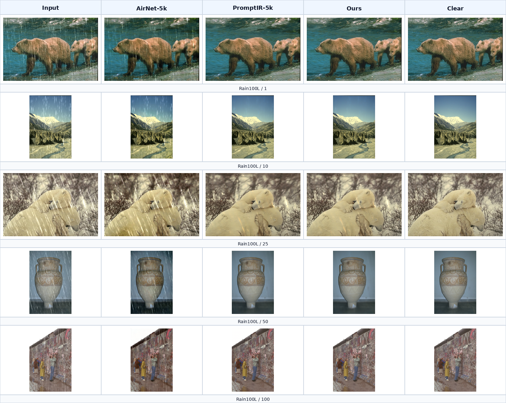
图5.2 Rain100L 复原效果总体对比

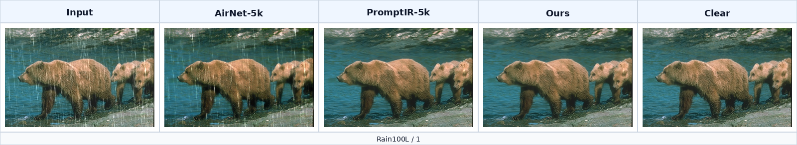
图5.3 Rain100L 样本 1 复原效果

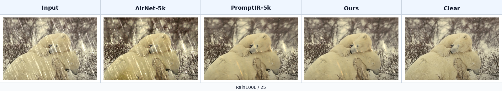
图5.4 Rain100L 样本 25 复原效果

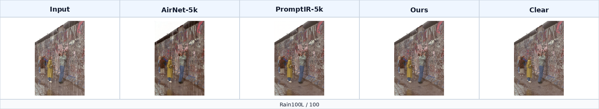
图5.5 Rain100L 样本 100 复原效果

## 5.2 其他去雨测试集结果

表5.2 给出了 MWIR-Net 在其他去雨测试集上的结果。Rain100H 的常规完整集 PSNR 为 25.05 dB，SSIM 为 0.7800，LPIPS 为 0.239191。相比 Rain100L，强雨纹和复杂背景使指标下降明显。Test1200 和 Test2800 上的 PSNR 分别为 30.03 dB 和 30.66 dB，说明模型在大规模合成测试集上保持了较稳定表现。GT-RAIN-test 的 PSNR 为 21.03 dB，SSIM 为 0.5963，LPIPS 为 0.293823，真实雨图与合成训练数据之间仍存在分布差异。

真实雨图结果较低并不意外。GT-RAIN-test 中存在雨滴积聚、反光和局部水雾，退化并非单一雨纹层。模型用合成成对数据训练，主要学习雨纹和背景之间的映射关系，对真实雨滴的透明遮挡和镜面反射建模不足。后续若加入真实雨图弱监督训练或无参考质量约束，可能改善真实场景泛化。
Rain100H 的 TTA 版本当前只完成 56 张图像，PSNR 为 25.77 dB，SSIM 为 0.7989，LPIPS 为 0.223682。由于图像数量不完整，该结果只说明 TTA 在已完成样本上有收益，不能直接替代 100 张完整集结果。论文主表采用完整常规推理结果。
Test1200 和 Test2800 的图像数量较多，结果更能反映模型在合成去雨数据上的平均表现。MWIR-Net 在 Test2800 上达到 30.66 dB PSNR 和 0.9078 SSIM，说明模型并非只适合 Rain100L。Test100 的 PSNR 只有 23.77 dB，可能与该数据集样本难度和图像内容有关。不同测试集之间指标不能直接横向比较，更适合在同一测试集内比较方法。
GT-RAIN-test 的 LPIPS 为 0.293823，远高于合成测试集。这说明真实雨图不仅像素误差大，感知空间差异也更明显。真实雨场景中，无雨参考帧和有雨帧之间可能存在轻微运动或光照变化，成对指标本身也更严格。论文中保留该结果，是为了反映模型当前边界，而不是只展示较容易的数据集。

表5.2 MWIR-Net 在其他去雨测试集上的结果
| 测试集 | 图像数 | PSNR | SSIM | LPIPS |
| --- | --- | --- | --- | --- |
| Rain100H | 100 | 25.05 | 0.7800 | 0.239191 |
| Test100 | 98 | 23.77 | 0.8002 | 0.165610 |
| Test1200 | 1200 | 30.03 | 0.8702 | 0.090416 |
| Test2800 | 2800 | 30.66 | 0.9078 | 0.057636 |
| GT-RAIN-test | 2100 | 21.03 | 0.5963 | 0.293823 |

## 5.3 SOTS outdoor 去雾结果

去雾任务在 SOTS outdoor 上表现更好。表5.3 显示，MWIR-Net-stage2_charb_edge002_tta_dehaze 达到 32.04 dB PSNR、0.9804 SSIM 和 0.009871 LPIPS，三项指标均优于本实验中复算的 PromptIR、AirNet 和 CLAHE。与常规推理版本相比，TTA 使 PSNR 从 31.69 dB 提升到 32.04 dB，LPIPS 从 0.010678 降到 0.009871。

图5.7 至图5.10 展示了去雾可视化结果。MWIR-Net 复原后的天空和远景区域更接近真值，建筑轮廓和树木边缘也较清晰。CLAHE 能增强局部对比度，但容易造成颜色偏移和噪声放大。PromptIR 官方模型整体稳定，但在本实验口径下颜色恢复略偏保守。MWIR-Net 的优势可能来自二阶段去雾微调和边缘一致性约束，使网络在恢复全局对比度的同时保留了远景结构。
NYU-Haze500 上，MWIR-Net-final_plain_multisplit_dehaze 的 PSNR 为 17.20 dB，SSIM 为 0.8239，LPIPS 为 0.101394。该结果低于 SOTS outdoor，说明不同室内场景和深度分布会削弱模型泛化。去雾模型对训练数据的合成方式较敏感，后续需要扩充不同深度图来源和真实雾图样本。
从 SOTS outdoor 的可视化图看，MWIR-Net 对道路、建筑和树木区域的颜色恢复较自然，没有出现大面积过饱和。远景区域的边缘仍有轻微平滑，这是去雾任务常见的折中。若过度强调边缘，远处树枝和建筑线条会变得不自然；若只追求颜色一致，细节又会被雾化残留覆盖。当前结果在结构和颜色之间取得了较合理的平衡。
CLAHE 的结果说明传统增强方法与复原方法存在本质差异。它能够提升局部对比度，但没有显式估计雾退化，也不会恢复被散射削弱的真实辐射。部分图像经 CLAHE 处理后看起来更清晰，PSNR 和 LPIPS 却明显较差。这也说明，论文中的客观指标与主观观察需要结合分析，不能只用单一观感判断模型优劣。

表5.3 SOTS outdoor 去雾结果
| 方法 | 图像数 | PSNR | SSIM | LPIPS |
| --- | --- | --- | --- | --- |
| MWIR-Net-stage2_charb_edge002_tta_dehaze | 500 | 32.04 | 0.9804 | 0.009871 |
| MWIR-Net-final_plain_multisplit_dehaze | 500 | 31.69 | 0.9791 | 0.010678 |
| MWIR-Net-derain_stage2_epoch1 | 500 | 31.58 | 0.9797 | 0.010772 |
| PromptIR-5k-12epoch-init | 500 | 30.49 | 0.9783 | 0.012616 |
| PromptIR-official | 500 | 30.35 | 0.9769 | 0.013528 |
| AirNet-official-All | 500 | 27.68 | 0.9582 | 0.027301 |
| CLAHE | 500 | 16.30 | 0.7830 | 0.168826 |

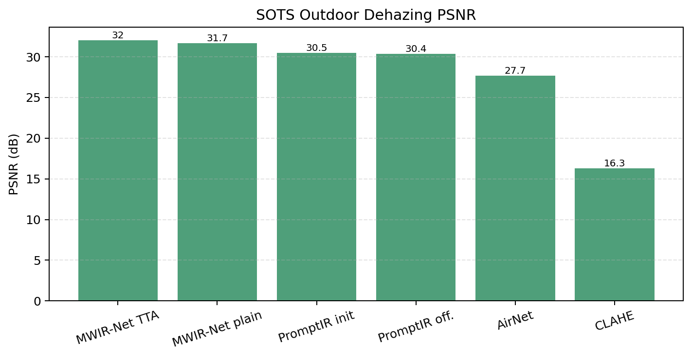
图5.6 SOTS outdoor 去雾指标对比

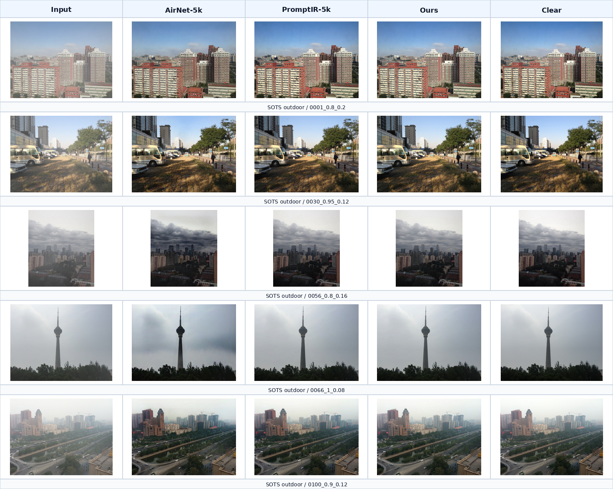
图5.7 SOTS outdoor 复原效果总体对比

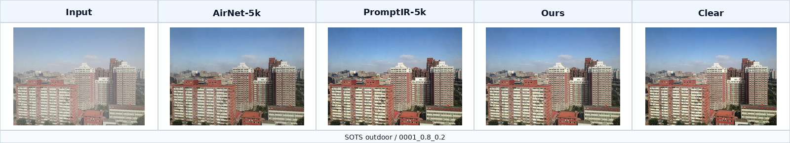
图5.8 SOTS outdoor 样本 0001 复原效果

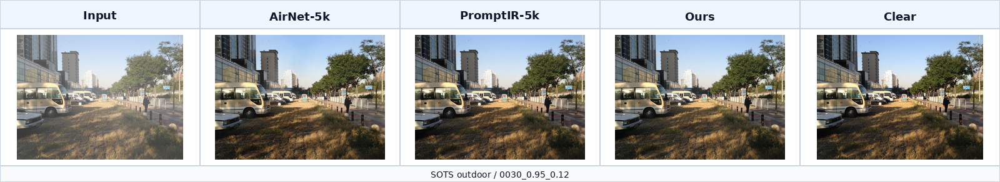
图5.9 SOTS outdoor 样本 0030 复原效果

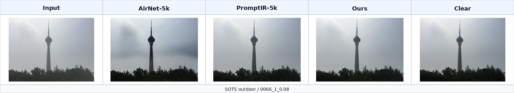
图5.10 SOTS outdoor 样本 0066 复原效果

## 5.4 消融实验

消融实验在 Rain100L 上进行。模型均从 5k_12epoch_init 最后一轮权重初始化，使用相同训练数据、训练轮数、学习率和损失函数，仅改变 ablation_mode。表5.4 给出 seed 0、1、2 三次重复的均值和标准差。

no_channel_attention 的 PSNR 均值比 zero_prompt 高 0.0089 dB，SSIM 均值低 0.000008，LPIPS 均值低 0.000223。三项差异均小于对应标准差。根据这组实验，不能认定通道注意力在当前二阶段去雨微调协议下带来了稳定独立收益。更稳妥的解释是，prompt 分支和通道注意力的作用与训练时间、任务组合和初始化条件有关，需要更多训练轮数和完整 full 模式三种 seed 结果共同判断。
该结论对方法设计也有提示。天气感知 prompt 在理论上能提供退化类型信息，但若训练样本主要来自单任务去雨，网络可能已经通过主干特征区分雨纹模式，prompt 分支的额外信息被弱化。对于联合去雨去雾训练或真实混合退化场景，prompt 分支仍可能发挥更明显作用。
消融实验也提醒，模块设计不能只看单次结果。早期 2 epoch 单次实验中，去除通道注意力后的指标曾出现下降，但 8 epoch 三次重复后差异缩小到随机波动范围内。若只引用早期单次实验，很容易把偶然差异解释成稳定规律。本文采用均值和标准差报告，是为了使结论更稳妥。
后续应补充 full 模式三 seed 训练，并在去雾任务上重复相同消融。prompt 分支更可能在多任务条件下发挥作用，单任务去雨实验不足以完全评价其价值。还可以可视化 prompt 权重，观察输入为雨图和雾图时不同 prompt 原型的响应是否存在可解释差异。

表5.4 Rain100L 公平消融实验结果
| 模型 | PSNR mean±std | SSIM mean±std | LPIPS mean±std |
| --- | --- | --- | --- |
| zero_prompt | 32.7213±0.0404 | 0.941258±0.000583 | 0.087695±0.001282 |
| no_channel_attention | 32.7302±0.0425 | 0.941250±0.000573 | 0.087472±0.001323 |

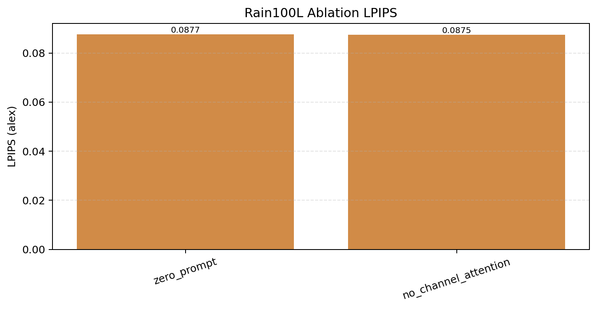
图5.11 Rain100L 消融实验 LPIPS 对比

## 5.5 综合分析

整体结果表明，MWIR-Net 在去雾任务上取得了较好的指标，在自训练去雨模型中也表现稳定。SOTS outdoor 的结果说明，多尺度 Transformer 主干和二阶段去雾微调能够处理大面积雾化和颜色恢复。Rain100L 的结果说明，网络能去除多数轻雨纹，但与官方强基线仍有差距。GT-RAIN-test 的结果提醒，合成数据训练不能完全覆盖真实雨场景。
从模型结构看，编码器和解码器的多尺度特征是性能基础。浅层特征保留纹理，深层特征提供全局上下文，跳跃连接有助于避免细节丢失。天气感知 prompt 的思路与当前多退化复原研究一致，但本实验的消融结果没有证明其在短程去雨微调中带来稳定独立收益。该结果并不否定 prompt 设计，而是说明需要更完整的多任务训练和更严格的消融设置。
从训练策略看，兼容初始化和二阶段微调比单纯从零训练更可靠。5k_12epoch 从零训练在 Rain100L 上只有 25.07 dB，而二阶段 TTA 版本达到 33.08 dB。去雾任务中，TTA 使 SOTS outdoor PSNR 提升 0.35 dB。推理增强不是模型能力的根本来源，但在当前训练规模下能带来稳定补充。
从评价口径看，统一复算是必要的。不同模型输出的尺寸、文件名和保存方式存在差异，若直接引用各自日志指标，比较结果容易偏移。本文使用同一脚本复算 PSNR、SSIM 和 LPIPS，使表格中的数值更可比较。主观图像与客观指标基本一致，但部分图像中仍存在指标较高、局部纹理略平滑的情况，因此论文同时保留可视化分析。

# 第6章 结论与展望

本课题围绕雾雨退化场景下的图像复原问题，完成了 MWIR-Net 的设计、实现和实验验证。网络采用多尺度 Transformer 编码器和解码器，在解码阶段引入天气感知 prompt，并结合 Charbonnier 重建损失、Sobel 边缘一致性约束和 TTA 自集成推理。实验覆盖去雨和去雾两类任务，测试集包括 Rain100L、Rain100H、Test100、Test1200、Test2800、GT-RAIN-test、SOTS outdoor 和 NYU-Haze500。
实验结果显示，MWIR-Net 在 SOTS outdoor 上取得 32.04 dB PSNR、0.9804 SSIM 和 0.009871 LPIPS，去雾表现优于本实验中复算的 PromptIR、AirNet 和 CLAHE。Rain100L 上，MWIR-Net TTA 版本达到 33.08 dB PSNR 和 0.9442 SSIM，较从零训练版本有明显提升，但仍低于官方 Restormer 和 PromptIR。其他去雨测试集结果表明，模型在合成数据上具有一定泛化能力，在真实雨图上仍受分布差异影响。
本文的主要工作包括三点。第一，构建了面向雾雨复原的数据组织和评估流程，实现了训练、推理、指标复算和可视化的闭环。第二，设计并实现了多尺度天气感知复原网络，能够在同一框架下处理去雨和去雾任务。第三，完成了多数据集对比和公平消融实验，对 prompt 分支和通道注意力的作用给出了谨慎分析。
当前工作仍有不足。训练数据规模和训练时间有限，去雨结果与官方强基线存在差距。真实雨图上的指标较低，说明模型对雨滴、反光和水雾混合退化的适应性不足。消融实验只完成 zero_prompt 和 no_channel_attention 两种模式，完整 full 模式的三 seed 重复仍需补充。去雾结果主要来自合成 SOTS outdoor，真实雾场景的无参考评价还不充分。
后续工作可从四个方向展开。其一，扩大训练数据规模，加入更多真实雨雾图像和混合退化样本，降低合成数据偏差。其二，补充完整消融实验，分析 prompt 数量、prompt 尺度、通道注意力和损失权重之间的关系。其三，引入无参考图像质量评价和下游检测任务，判断复原图像是否真正改善视觉系统性能。其四，研究轻量化部署，通过剪枝、蒸馏或低秩注意力降低推理成本，使模型更适合边缘设备和实时场景。

# 参考文献

[1] He K, Sun J, Tang X. Single image haze removal using dark channel prior[J]. IEEE Transactions on Pattern Analysis and Machine Intelligence, 2011, 33(12): 2341-2353.
[2] Li B, Ren W, Fu D, et al. Benchmarking single-image dehazing and beyond[J]. IEEE Transactions on Image Processing, 2019, 28(1): 492-505.
[3] Cai B, Xu X, Jia K, et al. DehazeNet: an end-to-end system for single image haze removal[J]. IEEE Transactions on Image Processing, 2016, 25(11): 5187-5198.
[4] Li B, Peng X, Wang Z, et al. AOD-Net: all-in-one dehazing network[C]//Proceedings of the IEEE International Conference on Computer Vision. Venice: IEEE, 2017: 4770-4778.
[5] Fu X, Huang J, Zeng D, et al. Removing rain from single images via a deep detail network[C]//Proceedings of the IEEE Conference on Computer Vision and Pattern Recognition. Honolulu: IEEE, 2017: 3855-3863.
[6] Yang W, Tan R T, Feng J, et al. Deep joint rain detection and removal from a single image[C]//Proceedings of the IEEE Conference on Computer Vision and Pattern Recognition. Honolulu: IEEE, 2017: 1357-1366.
[7] Zhang H, Patel V M. Density-aware single image de-raining using a multi-stream dense network[C]//Proceedings of the IEEE Conference on Computer Vision and Pattern Recognition. Salt Lake City: IEEE, 2018: 695-704.
[8] Ren D, Zuo W, Hu Q, et al. Progressive image deraining networks: a better and simpler baseline[C]//Proceedings of the IEEE/CVF Conference on Computer Vision and Pattern Recognition. Long Beach: IEEE, 2019: 3937-3946.
[9] Wang Z, Bovik A C, Sheikh H R, et al. Image quality assessment: from error visibility to structural similarity[J]. IEEE Transactions on Image Processing, 2004, 13(4): 600-612.
[10] Zhang R, Isola P, Efros A A, et al. The unreasonable effectiveness of deep features as a perceptual metric[C]//Proceedings of the IEEE Conference on Computer Vision and Pattern Recognition. Salt Lake City: IEEE, 2018: 586-595.
[11] Vaswani A, Shazeer N, Parmar N, et al. Attention is all you need[C]//Advances in Neural Information Processing Systems. Long Beach: Curran Associates, 2017: 5998-6008.
[12] Zamir S W, Arora A, Khan S, et al. Multi-stage progressive image restoration[C]//Proceedings of the IEEE/CVF Conference on Computer Vision and Pattern Recognition. Nashville: IEEE, 2021: 14821-14831.
[13] Zamir S W, Arora A, Khan S, et al. Restormer: efficient transformer for high-resolution image restoration[C]//Proceedings of the IEEE/CVF Conference on Computer Vision and Pattern Recognition. New Orleans: IEEE, 2022: 5728-5739.
[14] Li B, Liu X, Hu P, et al. All-in-one image restoration for unknown corruption[C]//Proceedings of the IEEE/CVF Conference on Computer Vision and Pattern Recognition. New Orleans: IEEE, 2022: 17452-17462.
[15] Valanarasu J M J, Yasarla R, Patel V M. TransWeather: transformer-based restoration of images degraded by adverse weather conditions[C]//Proceedings of the IEEE/CVF Conference on Computer Vision and Pattern Recognition. New Orleans: IEEE, 2022: 2353-2363.
[16] Potlapalli V, Zamir S W, Khan S H, et al. PromptIR: prompting for all-in-one image restoration[C]//Advances in Neural Information Processing Systems. New Orleans: Curran Associates, 2023.
[17] Loshchilov I, Hutter F. Decoupled weight decay regularization[C]//International Conference on Learning Representations. New Orleans: OpenReview, 2019.
[18] Charbonnier P, Blanc-Feraud L, Aubert G, et al. Deterministic edge-preserving regularization in computed imaging[J]. IEEE Transactions on Image Processing, 1997, 6(2): 298-311.
[19] Paszke A, Gross S, Massa F, et al. PyTorch: an imperative style, high-performance deep learning library[C]//Advances in Neural Information Processing Systems. Vancouver: Curran Associates, 2019: 8024-8035.

# 附录A 主要程序文件

net/mwirnet.py：定义 MWIR-Net 模型、Transformer block、天气感知 prompt 和消融模式。
train.py：定义 Lightning 训练流程、Charbonnier 损失、Sobel 边缘损失、AdamW 优化器和学习率调度。
test.py：定义去雨、去雾和 TTA 推理流程，并保存复原图像。
tools/evaluate_baseline_outputs.py：统一复算 PSNR、SSIM 和 LPIPS。
tools/make_visual_comparisons.py：生成论文和答辩使用的复原效果对比图。

# 附录B 指标复算说明

复算时读取保存后的 RGB 图像，预测图和目标图按共同尺寸中心裁剪，并裁剪到 16 的整数倍。
去雨任务优先按同名文件匹配目标图；若预测图和目标图后缀不同，则按文件 stem 匹配。
去雾任务按预测文件名第一个下划线前的 clean id 匹配目标图。
LPIPS 使用 alex backbone，数值越低表示感知距离越小。

# 致  谢

在本课题完成过程中，指导教师在选题、实验设计和论文撰写方面给予了持续帮助。从数据准备到模型训练，再到实验结果整理，每一次讨论都使本文的研究思路更加清晰。实验过程中，同学们在环境配置、数据集整理和结果核对方面提供了支持。家人在学习和生活上给予了理解与鼓励。谨向所有给予帮助的人表示诚挚感谢。
