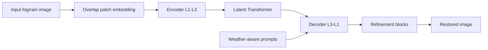

```mermaid
flowchart LR
  A[Input fog/rain image] --> B[Overlap patch embedding]
  B --> C[Encoder L1-L3]
  C --> D[Latent Transformer]
  D --> E[Decoder L3-L1]
  P[Weather-aware prompts] --> E
  E --> F[Refinement blocks]
  F --> G[Restored image]
```
图1-1 MWIR-Net总体结构源码

```mermaid
flowchart LR
  X[Feature] --> N1[LayerNorm]
  N1 --> A[MDTA Attention]
  A --> R1[Residual Add]
  R1 --> N2[LayerNorm]
  N2 --> F[GDFN]
  F --> R2[Residual Add]
```
图1-2 Transformer复原块源码

```mermaid
flowchart LR
  F[Decoder feature] --> GAP[Global pooling]
  GAP --> W[Linear + Softmax]
  W --> D[Prompt dictionary]
  D --> C[3x3 convolution]
  C --> CA[Channel attention]
  CA --> Fuse[Prompt fusion]
```
图1-3 天气感知提示模块源码

```mermaid
flowchart LR
  Datasets[Datasets] --> Prep[prepare_mwir_data.py]
  Prep --> Train[train.py]
  Train --> Ckpt[Checkpoints]
  Ckpt --> Test[test.py]
  Test --> Eval[evaluate_baseline_outputs.py]
  Eval --> Figures[Thesis figures and tables]
```
图1-4 实验流程源码
